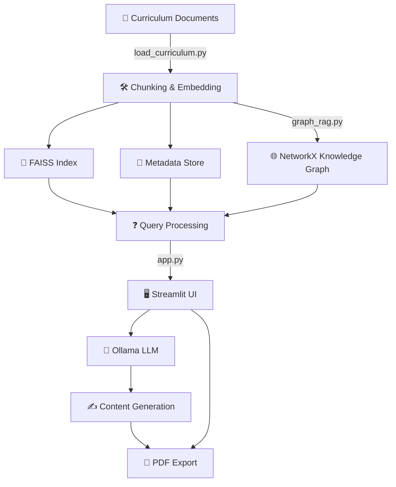

# 🎓 VicEduTutor: LLM-Powered Curriculum-Aligned Educational Activity Generator

<div align="center">


**An interactive web application that generates educational activities aligned with the Victorian Curriculum F–10 Version 2.0**

</div>

---

## ✨ Features

VicEduTutor is an interactive web application built with Streamlit, designed to generate educational activities aligned with the **Victorian Curriculum F–10 Version 2.0**. It leverages a Retrieval-Augmented Generation (RAG) system, powered by local Large Language Models (LLMs) via Ollama, to provide tailored lessons, stories, and activities for various learning areas and year levels (Foundation to Year 10). The app uses a knowledge graph, FAISS for vector search, and LLMs to create engaging content, downloadable as PDF.

### 🌟 Core Features

- **🖱️ Interactive Interface**: Select year level, subject, activity type (Story, Maths, Science, Custom), and query for personalized educational content
- **📖 Curriculum-Aligned**: Content is generated based on the Victorian Curriculum F–10 Version 2.0, covering 25 learning areas (e.g., English, Mathematics, Science, Arts, Languages)
- **🔍 RAG Pipeline**: Combines FAISS vector search with a NetworkX knowledge graph for precise curriculum retrieval, enhanced by LLM-generated responses
- **📄 PDF Export**: Download generated activities as professionally formatted PDFs using ReportLab
- **🤖 LLM Integration**: Uses local LLMs (e.g., LLaMA3) via Ollama for dynamic content generation, with fallback options
- **😊 Emoji Support**: Enhances readability with emoji-rich content, tailored to year levels

---

## 🏗️ Architecture

The application follows a modular design, with components for data processing, retrieval, LLM generation, and presentation. Below is a high-level overview:



---

## ⚙️ Installation

### 🔧 Prerequisites

- 🐍 Python 3.8+
- 🛠️ Virtual environment (recommended)
- 🤖 Ollama server running locally (default: `localhost:11434`)
- 😊 `seguiemj.ttf` font file for emoji support in PDFs (optional)

### 📋 Setup Steps

1. **📂 Clone the Repository**:

   ```bash
   git clone https://github.com/Logulokesh/VicEduTutor.git
   cd VicEduTutor
   ```

2. **🧪 Set Up Virtual Environment**:

   ```bash
   python -m venv venv
   source venv/bin/activate  # On Windows: venv\Scripts\activate
   ```

3. **📦 Install Dependencies**:

   ```bash
   pip install -r requirements.txt
   ```

4. **📚 Prepare Curriculum Data**:

   - Place curriculum `.docx` files in the `data/` folder (see `load_curriculum.py` for supported files)

   - Run `load_curriculum.py` to generate `curriculum_index.faiss`, `curriculum_metadata.json`, and `curriculum_graph.json`:

     ```bash
     python load_curriculum.py
     ```

5. **🤖 Set Up Ollama**:

   - Install Ollama and pull a model (e.g., `llama3`):

     ```bash
     ollama pull llama3
     ```

   - Ensure the Ollama server is running:

     ```bash
     ollama serve
     ```

6. **🚀 Run the Application**:

   ```bash
   streamlit run app.py
   ```

   Access the app at `http://localhost:8501`

---

## 🎓 Usage

1. **✅ Select Options**:

   - Choose a **📅 Year Level** (e.g., Foundation, Year 5)
   - Select an **📋 Activity Type** (Story, Maths, Science, or Custom)
   - For Custom, pick a **Subject** (e.g., Science) and enter a query (e.g., "What are reading strategies?") ❓
   - Choose an **🤖 Ollama Model** for LLM-powered content generation

2. **✍️ Generate Content**:

   - Click **Generate Activity** to retrieve curriculum-aligned content and generate LLM-enhanced responses
   - View the output in the UI and download it as a **📄 PDF**

3. **🔬 Explore**:

   - The app retrieves relevant curriculum chunks using FAISS and enriches context with a knowledge graph
   - LLM-generated content is tailored to the selected year level and subject, with emojis for engagement 😊

---

## 📁 Project Structure

```
VicEduTutor/
├── 🖥️ app.py                          # Main Streamlit application
├── 🌐 graph_rag.py                    # Knowledge graph and RAG system
├── 📑 load_curriculum.py              # Curriculum processing and indexing
├── 📋 requirements.txt                # Python dependencies
├── 📂 data/                           # Curriculum documents folder
├── 🔎 curriculum_index.faiss          # FAISS vector index
├── 💾 curriculum_metadata.json        # Metadata for curriculum chunks
├── 🌐 curriculum_graph.json           # Serialized knowledge graph
└── 📸 screenshots/                    # Application screenshots
```

---

## 🛠️ Dependencies

| Package | Purpose | Icon |
|---------|---------|------|
| **Streamlit** | Web app framework | 🖥️ |
| **ReportLab** | PDF generation | 📄 |
| **Sentence Transformers** | Text embeddings | 🔍 |
| **FAISS** | Vector similarity search | 🔎 |
| **NetworkX** | Knowledge graph | 🌐 |
| **Ollama** | Local LLM integration | 🤖 |
| **NumPy** | Numerical operations | 🔢 |

See `requirements.txt` for detailed versions.

---

## 🤝 Contributing

Contributions are welcome! To contribute:

1. 🍴 Fork the repository
2. 🌿 Create a feature branch (`git checkout -b feature/your-feature`)
3. ✅ Commit changes (`git commit -m "Add your feature"`)
4. 🚀 Push to the branch (`git push origin feature/your-feature`)
5. 📬 Open a Pull Request

Please ensure code follows PEP 8 and includes tests where applicable.

---

## 📜 License

This project is licensed under the MIT License. See the LICENSE file for details.

---

## 🙌 Acknowledgements

- Built with the Victorian Curriculum F–10 Version 2.0 📚
- Uses open-source libraries like Streamlit, FAISS, and NetworkX 🛠️

---

## 📸 Screenshots

<div align="center">

### 🎯 Main Interface


### 📚 Subject Selection


### ✍️ Content Generation


### 📄 Activity Output


### 🔍 Search Results


</div>

