# 🎓 KinAi-ScholarKit: LLM-Powered Curriculum-Aligned Educational Activity Generator

<div align="center">

[](https://www.python.org/downloads/release/python-380/)
[](https://docs.streamlit.io/1.28.0/)
[](https://opensource.org/licenses/MIT)
[](https://ollama.ai/)
[](https://github.com/ollama/ollama)


**An interactive web application that generates educational activities aligned with the Victorian Curriculum F–10 Version 2.0**

---

### 🚀 Quick Start | 📖 [Documentation](#-features) | 🤝 [Contributing](#-contributing) | 📜 [License](#-license)

</div>

---

## 🌟 Why KinAi-ScholarKit?

<div align="center">

| 🔍 **Problem** | ⚙️ **Solution** | ✅ **Result** |
|:---:|:---:|:---:|
| Time-consuming search for age-appropriate activities | AI-powered instant generation with local LLMs | Personalized PDFs in seconds |
| Generic content not aligned with curriculum | Victorian Curriculum F–10 Version 2.0 integration | School-standard aligned activities |
| Internet dependency and privacy concerns | Completely offline operation | Fast, private, secure content |

</div>

---

<!-- Row 1: Identify the Challenge -->
<table style="width: 100%; border-collapse: collapse; font-family: sans-serif; margin: 20px 0; box-shadow: 0 4px 6px rgba(0, 0, 0, 0.1); border-radius: 8px; overflow: hidden;">
  <tr>
    <td style="width: 200px; text-align: center; vertical-align: top; padding: 40px; background: linear-gradient(135deg, #667eea 0%, #764ba2 100%);">
      
    </td>
    <td style="padding: 40px; vertical-align: top; background: #ffffff;">
      <h2 style="color: #2563eb; display: flex; align-items: center; gap: 10px; margin-top: 0; font-size: 1.5em;">
        <span style="font-size: 24px;">🔍</span> 1. Identify the Challenge
      </h2>
      <p style="font-size: 1.1em; line-height: 1.6; color: #4a5568;">
        Like many parents, when my daughter asks for a fun learning activity, I end up searching the internet for something age-appropriate and educational.
        It takes time, often leads to generic results, and doesn't always match what she's learning in school.
      </p>
      <div style="font-size: 24px; margin-top: 20px; text-align: center;">🎯 🌐 🤖 🎓</div>
    </td>
  </tr>
</table>

<!-- Row 2: Engineer the Approach -->
<table style="width: 100%; border-collapse: collapse; font-family: sans-serif; margin: 20px 0; box-shadow: 0 4px 6px rgba(0, 0, 0, 0.1); border-radius: 8px; overflow: hidden;">
  <tr>
    <td style="padding: 40px; vertical-align: top; background: #ffffff;">
      <h2 style="color: #16a34a; display: flex; align-items: center; gap: 10px; margin-top: 0; font-size: 1.5em;">
        <span style="font-size: 24px;">⚙️</span> 2. Engineer the Approach
      </h2>
      <p style="font-size: 1.1em; line-height: 1.6; color: #4a5568;">
        KinAi-ScholarKit uses <strong>AI and local LLMs</strong> to instantly generate custom learning activities based on:
      </p>
      <ul style="font-size: 1.1em; line-height: 1.6; color: #4a5568; padding-left: 20px;">
        <li>📅 Child's year level</li>
        <li>📚 Subject (e.g., Science, Maths)</li>
        <li>🎯 Type of activity (Story, Quiz, Worksheet)</li>
      </ul>
      <p style="font-size: 1.1em; line-height: 1.6; color: #4a5568;">
        All done <strong>offline</strong>, without needing an internet connection—ensuring fast, private, and curriculum-aligned content generation at home or on the go.
      </p>
      <div style="font-size: 24px; margin-top: 20px; text-align: center;">🧠 📚 🧠 🔍 📄</div>
    </td>
    <td style="width: 200px; text-align: center; vertical-align: top; padding: 40px; background: linear-gradient(135deg, #f093fb 0%, #f5576c 100%);">
      
    </td>
  </tr>
</table>

<!-- Row 3: Implement the Outcome -->
<table style="width: 100%; border-collapse: collapse; font-family: sans-serif; margin: 20px 0; box-shadow: 0 4px 6px rgba(0, 0, 0, 0.1); border-radius: 8px; overflow: hidden;">
  <tr>
    <td style="width: 200px; text-align: center; vertical-align: top; padding: 40px; background: linear-gradient(135deg, #4facfe 0%, #00f2fe 100%);">
      
    </td>
    <td style="padding: 40px; vertical-align: top; background: #ffffff;">
      <h2 style="color: #dc2626; display: flex; align-items: center; gap: 10px; margin-top: 0; font-size: 1.5em;">
        <span style="font-size: 24px;">✅</span> 3. Implement the Outcome
      </h2>
      <p style="font-size: 1.1em; line-height: 1.6; color: #4a5568;">
        Get a personalized, downloadable PDF activity in seconds—no ads, no scrolling, just relevant, curriculum-aligned learning that fits your child's needs.
        Perfect for busy parents or teachers who want smart, fast, offline educational content that matches school standards.
      </p>
      <div style="font-size: 24px; margin-top: 20px; text-align: center;">📄 ✅ 📱 🎯 🎉</div>
    </td>
  </tr>
</table>

---

## ✨ Features

<div align="center">

KinAi-ScholarKit is an interactive web application built with Streamlit, designed to generate educational activities aligned with the **Victorian Curriculum F–10 Version 2.0**. It leverages a Retrieval-Augmented Generation (RAG) system, powered by local Large Language Models (LLMs) via Ollama, to provide tailored lessons, stories, and activities for various learning areas and year levels (Foundation to Year 10). The app uses a knowledge graph, FAISS for vector search, and LLMs to create engaging content, downloadable as PDF.

</div>

### 🌟 Core Features

<div style="display: grid; grid-template-columns: repeat(auto-fit, minmax(300px, 1fr)); gap: 20px; margin: 20px 0;">

<div style="padding: 20px; border: 2px solid #e2e8f0; border-radius: 8px; background: linear-gradient(135deg, #667eea22 0%, #764ba222 100%);">

**🖱️ Interactive Interface**
Select year level, subject, activity type (Story, Maths, Science, Custom), and query for personalized educational content

</div>

<div style="padding: 20px; border: 2px solid #e2e8f0; border-radius: 8px; background: linear-gradient(135deg, #f093fb22 0%, #f5576c22 100%);">

**📖 Curriculum-Aligned**
Content is generated based on the Victorian Curriculum F–10 Version 2.0, covering 25 learning areas (e.g., English, Mathematics, Science, Arts, Languages)

</div>

<div style="padding: 20px; border: 2px solid #e2e8f0; border-radius: 8px; background: linear-gradient(135deg, #4facfe22 0%, #00f2fe22 100%);">

**🔍 RAG Pipeline**
Combines FAISS vector search with a NetworkX knowledge graph for precise curriculum retrieval, enhanced by LLM-generated responses

</div>

<div style="padding: 20px; border: 2px solid #e2e8f0; border-radius: 8px; background: linear-gradient(135deg, #43e97b22 0%, #38f9d722 100%);">

**📄 PDF Export**
Download generated activities as professionally formatted PDFs using ReportLab

</div>

<div style="padding: 20px; border: 2px solid #e2e8f0; border-radius: 8px; background: linear-gradient(135deg, #fa709a22 0%, #fee14022 100%);">

**🤖 LLM Integration**
Uses local LLMs (e.g., LLaMA3) via Ollama for dynamic content generation, with fallback options

</div>

<div style="padding: 20px; border: 2px solid #e2e8f0; border-radius: 8px; background: linear-gradient(135deg, #a8edea22 0%, #fed6e322 100%);">

**😊 Emoji Support**
Enhances readability with emoji-rich content, tailored to year levels

</div>

</div>

---

## 🏗️ Architecture

<div align="center">

The application follows a modular design, with components for data processing, retrieval, LLM generation, and presentation. Below is a high-level overview:

```mermaid
graph TD
    A[📑 Curriculum Documents] -->|load_curriculum.py| B[🛠️ Chunking & Embedding]
    B --> C[🔎 FAISS Index]
    B --> D[💾 Metadata Store]
    B -->|graph_rag.py| E[🌐 NetworkX Knowledge Graph]
    C --> F[❓ Query Processing]
    D --> F
    E --> F
    F -->|app.py| G[🖥️ Streamlit UI]
    G --> H[🤖 Ollama LLM]
    H --> I[✍️ Content Generation]
    I --> J[📄 PDF Export]
    G --> J
```

</div>



---

## ⚙️ Installation

### 🔧 Prerequisites

<div style="background: #f7fafc; padding: 20px; border-radius: 8px; border-left: 4px solid #4299e1; margin: 20px 0;">

- 🐍 **Python 3.8+**
- 🛠️ **Virtual environment** (recommended)
- 🤖 **Ollama server** running locally (default: `localhost:11434`)
- 😊 **`seguiemj.ttf`** font file for emoji support in PDFs (optional)

</div>

### 📋 Setup Steps

<details>
<summary><strong>🔽 Click to expand installation steps</strong></summary>

1. **📂 Clone the Repository**:

   ```bash
   git clone https://github.com/Logulokesh/KinAi-ScholarKit.git
   cd KinAi-ScholarKit
   ```

2. **🧪 Set Up Virtual Environment**:

   ```bash
   python -m venv venv
   source venv/bin/activate  # On Windows: venv\Scripts\activate
   ```

3. **📦 Install Dependencies**:

   ```bash
   pip install -r requirements.txt
   ```

4. **📚 Prepare Curriculum Data**:

   - Place curriculum `.docx` files in the `data/` folder (see `load_curriculum.py` for supported files)

   - Run `load_curriculum.py` to generate `curriculum_index.faiss`, `curriculum_metadata.json`, and `curriculum_graph.json`:

     ```bash
     python load_curriculum.py
     ```

5. **🤖 Set Up Ollama**:

   - Install Ollama and pull a model (e.g., `llama3`):

     ```bash
     ollama pull llama3
     ```

   - Ensure the Ollama server is running:

     ```bash
     ollama serve
     ```

6. **🚀 Run the Application**:

   ```bash
   streamlit run app.py
   ```

   Access the app at `http://localhost:8501`

</details>

---

## 🎓 Usage

<div style="background: linear-gradient(135deg, #667eea11 0%, #764ba211 100%); padding: 30px; border-radius: 12px; margin: 20px 0;">

### 🎯 Step-by-Step Guide

1. **✅ Select Options**:
   - Choose a **📅 Year Level** (e.g., Foundation, Year 5)
   - Select an **📋 Activity Type** (Story, Maths, Science, or Custom)
   - For Custom, pick a **Subject** (e.g., Science) and enter a query (e.g., "What are reading strategies?") ❓
   - Choose an **🤖 Ollama Model** for LLM-powered content generation

2. **✍️ Generate Content**:
   - Click **Generate Activity** to retrieve curriculum-aligned content and generate LLM-enhanced responses
   - View the output in the UI and download it as a **📄 PDF**

3. **🔬 Explore**:
   - The app retrieves relevant curriculum chunks using FAISS and enriches context with a knowledge graph
   - LLM-generated content is tailored to the selected year level and subject, with emojis for engagement 😊

</div>

---

## 📁 Project Structure

<div style="background: #f7fafc; padding: 20px; border-radius: 8px; font-family: monospace; line-height: 1.6;">

```
KinAi-ScholarKit/
├── 🖥️ app.py                          # Main Streamlit application
├── 🌐 graph_rag.py                    # Knowledge graph and RAG system
├── 📑 load_curriculum.py              # Curriculum processing and indexing
├── 📋 requirements.txt                # Python dependencies
├── 📂 data/                           # Curriculum documents folder
├── 🔎 curriculum_index.faiss          # FAISS vector index
├── 💾 curriculum_metadata.json        # Metadata for curriculum chunks
├── 🌐 curriculum_graph.json           # Serialized knowledge graph
└── 📸 screenshots/                    # Application screenshots
```

</div>

---

## 🛠️ Dependencies

<div align="center">

| Package | Purpose | Icon | Version |
|:-------:|:-------:|:----:|:-------:|
| **Streamlit** | Web app framework | 🖥️ | `1.28+` |
| **ReportLab** | PDF generation | 📄 | `Latest` |
| **Sentence Transformers** | Text embeddings | 🔍 | `Latest` |
| **FAISS** | Vector similarity search | 🔎 | `Latest` |
| **NetworkX** | Knowledge graph | 🌐 | `Latest` |
| **Ollama** | Local LLM integration | 🤖 | `Compatible` |
| **NumPy** | Numerical operations | 🔢 | `Latest` |

<small>See `requirements.txt` for detailed versions.</small>

</div>

---

## 🤝 Contributing

<div style="background: linear-gradient(135deg, #43e97b11 0%, #38f9d711 100%); padding: 30px; border-radius: 12px; margin: 20px 0;">

Contributions are welcome! To contribute:

1. 🍴 **Fork** the repository
2. 🌿 **Create** a feature branch (`git checkout -b feature/your-feature`)
3. ✅ **Commit** changes (`git commit -m "Add your feature"`)
4. 🚀 **Push** to the branch (`git push origin feature/your-feature`)
5. 📬 **Open** a Pull Request

<div style="background: #fff3cd; padding: 15px; border-radius: 6px; border-left: 4px solid #ffc107; margin-top: 15px;">
<strong>📝 Code Standards:</strong> Please ensure code follows PEP 8 and includes tests where applicable.
</div>

</div>

---

## 📜 License

<div align="center" style="background: #e3f2fd; padding: 20px; border-radius: 8px; margin: 20px 0;">

This project is licensed under the **MIT License**. See the LICENSE file for details.

</div>

---

## 🙌 Acknowledgements

<div style="background: linear-gradient(135deg, #fa709a11 0%, #fee14011 100%); padding: 20px; border-radius: 8px; text-align: center;">

- Built with the **Victorian Curriculum F–10 Version 2.0** 📚
- Uses open-source libraries like **Streamlit**, **FAISS**, and **NetworkX** 🛠️
- Powered by the amazing open-source community 🌟

</div>

---

## 📸 Screenshots

<div align="center">

<details>
<summary><strong>🖼️ Click to view application screenshots</strong></summary>

<br>

### 🎯 Main Interface


### 📚 Subject Selection


### ✍️ Content Generation


### 📄 Activity Output


### 🔍 Search Results


</details>

</div>

---

<div align="center" style="margin: 40px 0; padding: 20px; background: linear-gradient(135deg, #667eea 0%, #764ba2 100%); border-radius: 12px; color: white;">

### 🚀 Ready to get started?

**[⬇️ Download KinAi-ScholarKit](https://github.com/Logulokesh/KinAi-ScholarKit)** | **[📖 Read the Docs](#-features)** | **[💬 Get Support](#-contributing)**

<small>Made with ❤️ for educators, parents, and students everywhere</small>

</div>
